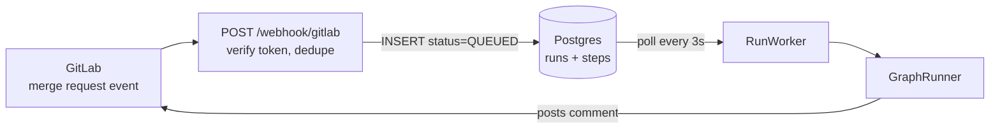
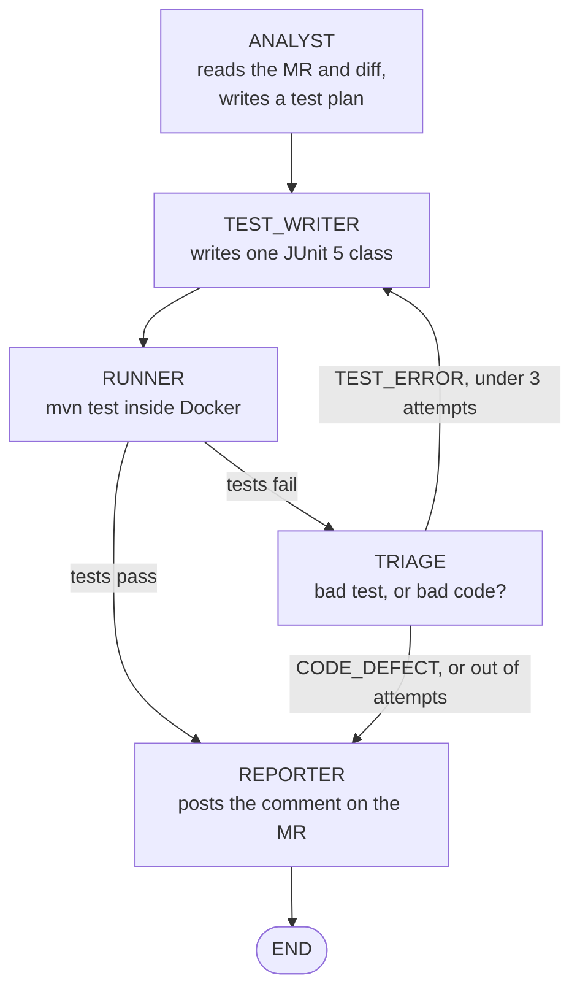

# AgentQA

**An autonomous QA engineer for GitLab merge requests.**

Open a merge request, and AgentQA reads what you *said* the change should do, writes JUnit
tests for that, runs them in a throwaway Docker container, and comments the results back on
the MR.

The trick is that it tests against your **merge request description**, not against your code.
So when a test fails, it can tell you whether the *test* is wrong or your *code* is wrong.

---

## A real run

Merge request: *"Apply 10% discount when a coupon code is set"*, touching `CartService.java`.

**1. The Analyst** read the MR and the diff, and rated it `HIGH` risk:

> The implementation subtracts a fixed 0.10 instead of applying a 10% discount, so the
> promised behaviour is not met.

**2. The Test Writer** wrote assertions for what the MR *promised* — a 10% discount on an
80.00 cart — rather than mirroring what the code actually does.

**3. The Runner** executed them in Docker. Two of four tests failed:

```
expected: <72.0> but was: <79.9>
expected: <90.0> but was: <99.9>
```

**4. The Triage engineer** decided the test was right and the code was wrong:

> `CODE_DEFECT` — Expected discounted total 72.0 but got 79.9; the discount logic is wrong
> at line `total = total - 0.10;` in `totalPrice()`

**5. The Reporter** posted all of it as a comment on the MR.

Elapsed: **33 seconds**, webhook to comment. The bug was a fixed `- 0.10` where a `* 0.90`
was intended — the kind of thing that reads fine in review and ships.

---

## How it works



**Why the database in the middle?** GitLab times out a webhook in about 10 seconds. A run
takes 15–50 seconds — three LLM calls plus a Maven build. So the webhook does the minimum
(check the token, ignore duplicates, write a `QUEUED` row, return `200`) and a background
worker does the slow part.

---

## The agent graph

Five agents, each a `@Component` implementing `Agent`. `GraphRunner` walks them as a state
machine and saves a `StepRecord` for every node it enters.



| Agent | Does | Uses |
|---|---|---|
| **Analyst** | Fetches the MR and its changes, picks the first changed `.java` file, produces a JSON test plan | GitLab + LLM |
| **Test Writer** | Turns the plan into one JUnit 5 class. On a retry it is shown the previous build output | LLM |
| **Runner** | Writes a sandbox project to a temp dir and runs `mvn test` in a container | Docker |
| **Triage** | Reads the failure and returns `TEST_ERROR` or `CODE_DEFECT` | LLM |
| **Reporter** | Composes markdown and posts it as an MR note | GitLab |

The Runner is the only agent that does not call the LLM.

### Why the prompts matter

The Test Writer is explicitly told **not** to trust the source:

> Test the behaviour described in the test plan, not the behaviour you infer from the source.
> If the source appears to contradict the plan, still assert what the plan says. A failing
> test that exposes a real defect is a valuable and correct outcome.
> Never weaken an assertion to make a test pass.

It is also forbidden from using reflection, `Assumptions`, or stubbing the class under test —
the usual ways a model quietly makes a red test go green.

### Why Docker

The test code was written by a language model. It runs in a disposable container with a
mounted temp directory and a 5-minute timeout, and the container is destroyed either way.

---

## Stack

| | |
|---|---|
| Language | Java 21 |
| Framework | Spring Boot 4.1.1 |
| Build | Maven (wrapper included) |
| Web | Spring MVC, `RestClient` for outbound HTTP |
| JSON | Jackson 3 (note the `tools.jackson.databind` package — Boot 4's new namespace) |
| Persistence | Spring Data JPA + Hibernate 7 |
| Database | PostgreSQL 16 |
| Scheduling | `@Scheduled(fixedDelay = 3000)` |
| LLM | Groq, `openai/gpt-oss-120b` |
| VCS | GitLab REST API v4 |
| Sandbox | Docker, `maven:3.9-eclipse-temurin-21`, JUnit 5.10.2 |

No agent framework — the graph and the LLM client are both hand-written, which keeps the
whole system to 17 files.

---

## Running it

**Prerequisites:** Java 21, Docker (used twice — once for Postgres, once as the test
sandbox), and a GitLab project you can add a webhook to.

**1. Start Postgres**

```bash
docker compose up -d
```

Postgres 16 on host port **5433**, database/user/password all `agentqa`.

**2. Set credentials**

Both are read from the environment and validated at startup, so the app fails fast if either
is missing.

```bash
export GROQ_API_KEY=...      # https://console.groq.com
export GITLAB_TOKEN=...      # GitLab PAT with api scope
```

**3. Run**

```bash
./mvnw spring-boot:run       # mvnw.cmd on Windows
```

**4. Point GitLab at it**

GitLab.com cannot reach `localhost`, so expose port 8080 first (ngrok or similar). Then in
your project: **Settings → Webhooks**

- URL: `https://your-tunnel/webhook/gitlab`
- Secret token: must match `agentqa.webhook.secret`
- Trigger: **Merge request events**

The webhook only acts on `merge_request` events with action `open`, `update`, or `reopen`,
and ignores a commit it is already working on.

---

## API

| Endpoint | Purpose |
|---|---|
| `POST /webhook/gitlab` | Receives GitLab MR events. Requires a matching `X-Gitlab-Token`. |
| `GET /runs` | Recent runs, newest first. `?limit=N` (1–100, default 20). |
| `GET /runs/{id}` | One run and its full step timeline. `404` if unknown. |

`GET /runs/{id}` is the quickest way to see what a run did:

```json
{
  "id": 32,
  "status": "DONE",
  "durationSeconds": 33.273,
  "path": "ANALYST#1 -> TEST_WRITER#1 -> RUNNER#1 -> TRIAGE#1 -> REPORTER#1",
  "steps": [
    { "agent": "ANALYST",     "attempt": 1, "outcome": "OK", "durationSeconds": 3.788 },
    { "agent": "TEST_WRITER", "attempt": 1, "outcome": "OK", "durationSeconds": 2.054 },
    { "agent": "RUNNER",      "attempt": 1, "outcome": "OK", "durationSeconds": 24.504 },
    { "agent": "TRIAGE",      "attempt": 1, "outcome": "OK", "durationSeconds": 1.014 },
    { "agent": "REPORTER",    "attempt": 1, "outcome": "OK", "durationSeconds": 0.499 }
  ]
}
```

`path` is the whole graph traversal on one line. A run that hits the retry loop reads
`TEST_WRITER#1 -> RUNNER#1 -> TRIAGE#1 -> TEST_WRITER#2 -> RUNNER#2`. `detail` carries the
exception message when a step fails, and `durationSeconds` is `null` while a step is still
in flight — so you can poll this mid-run.

---

## Configuration

`src/main/resources/application.properties`:

| Key | Default | |
|---|---|---|
| `agentqa.webhook.secret` | `dev-secret-123` | Must match the GitLab webhook secret |
| `agentqa.gitlab.base-url` | `https://gitlab.com` | Change for self-hosted |
| `spring.datasource.url` | `...localhost:5433/agentqa` | Matches `docker-compose.yml` |
| `spring.jpa.hibernate.ddl-auto` | `update` | Schema is created on first run |

---

## Project layout

```
com.agentqa
├── webhook/    WebhookController      receives GitLab events, queues a run
├── worker/     RunWorker              polls the queue, drives the graph
├── graph/      GraphRunner            the state machine, records each step
├── agent/      Agent                  the contract, plus nested Node (the
│                                      graph positions) and State (the
│                                      blackboard passed between agents)
│               Analyst, TestWriter, Runner, Triage, Reporter
├── llm/        LlmClient              Groq calls + tolerant JSON parsing
├── gitlab/     GitLabClient           MR, changes, raw file, post comment
└── run/        Run                    the runs table, plus nested Status
                StepRecord             the steps table, one row per node
                RunRepository, StepRecordRepository
                RunController          the read API
```

`Agent.State` is the in-memory object each agent reads and writes as the graph advances. It holds
the test plan, the source under test, the generated code, the last build error, and the triage
verdict.

---

## Known limitations

Worth knowing before you extend it.

- **One file per MR.** The Analyst takes the *first* changed `.java` file and ignores the rest.
- **Default package only.** The Runner writes the source flat into `src/main/java`, so a class
  with a `package` declaration will not compile in the sandbox.
- **Single instance.** `RunWorker` claims work with a plain read-then-save. Two instances would
  process the same MR twice; this needs `SELECT ... FOR UPDATE SKIP LOCKED`.
- **A crash mid-run strands the row.** `Agent.State` is never persisted and nothing requeues a
  stale `RUNNING` run at startup.
- **`GET /runs` has no auth**, unlike the webhook. Fine on localhost, not beyond it.
- **No outbound timeouts.** A hung Groq or GitLab call stalls the worker.
- **No migrations.** `ddl-auto=update` is fine for now; Flyway before this is real.
- **Tests need Postgres running.** `RunRepositoryTest` runs against the real database from
  `docker compose up -d` rather than an embedded one, so `./mvnw test` fails if the container
  is down. Every test is transactional and rolls back, so it leaves no rows behind.
- **The test plan and generated code are not persisted** — only the step timeline is, so
  `GET /runs/{id}` shows what ran, not what was written.
