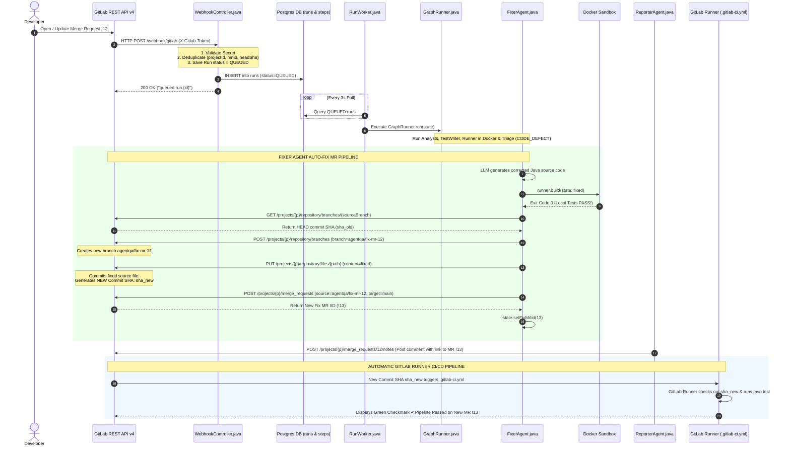
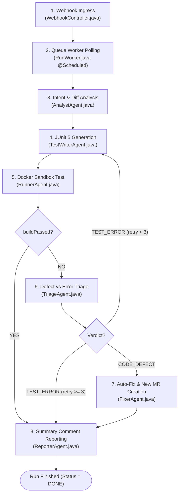

# AgentQA — Unified GitLab Integration & Master Project Guide

This master technical document combines the complete **GitLab Integration & Auto-Fix MR Creation Pipeline** with **all 8 key execution steps, 6 autonomous agents, database schemas, and codebase blueprints** into a single, unified reference guide.

---

## 1. Executive Summary & Core Purpose

**AgentQA** is an autonomous AI-driven QA system and self-healing MR engine built for GitLab. When a developer opens or updates a Merge Request (MR), AgentQA automatically:
1. Ingests the webhook event asynchronously into a PostgreSQL task queue.
2. Downloads the modified Java source code and git diffs via GitLab REST API v4.
3. Formulates a behavior-driven JUnit 5 test plan asserting **what the MR description promises** (rather than trusting self-referential existing code).
4. Compiles and executes tests inside an isolated Docker container sandbox (`maven:3.9-eclipse-temurin-21`).
5. Triages failures to distinguish between test errors (`TEST_ERROR`) and real source code bugs (`CODE_DEFECT`).
6. **Automated Self-Healing**: For code defects, generates corrected Java source code, re-verifies the fix locally in Docker, creates a fix branch (`agentqa/fix-mr-{iid}`), commits the fix, and opens a **New Auto-Fix MR on GitLab**.
7. Reports all findings and links as Markdown notes back on the original MR.

---

## 2. GitLab Integration & Auto-Fix MR Mechanics (Deep Dive)

The interaction between AgentQA and GitLab operates in two directions: **Inbound (Webhooks)** and **Outbound (GitLab REST API v4)**.



### The 8 GitLab REST API v4 Calls in [GitLabClient.java](file:///c:/Users/ADMIN/Desktop/Voziq/AgentQA/src/main/java/com/agentqa/gitlab/GitLabClient.java)

1. **`getMergeRequest(projectId, mrIid)`** $\rightarrow$ `GET /api/v4/projects/{p}/merge_requests/{i}`  
   Fetches MR title, description, and branch metadata.
2. **`getChanges(projectId, mrIid)`** $\rightarrow$ `GET /api/v4/projects/{p}/merge_requests/{i}/changes`  
   Fetches list of modified files and git diffs.
3. **`getFile(projectId, path, ref)`** $\rightarrow$ `GET /api/v4/projects/{p}/repository/files/{path}/raw?ref={ref}`  
   Downloads raw Java source file content from the specific branch or commit SHA.
4. **`postComment(projectId, mrIid, body)`** $\rightarrow$ `POST /api/v4/projects/{p}/merge_requests/{i}/notes`  
   Posts Markdown summary note on the MR.
5. **`getBranchSha(projectId, branch)`** $\rightarrow$ `GET /api/v4/projects/{p}/repository/branches/{branch}`  
   Fetches the HEAD commit SHA of the source branch.
6. **`createBranch(projectId, newBranch, fromRef)`** $\rightarrow$ `POST /api/v4/projects/{p}/repository/branches?branch={b}&ref={r}`  
   Creates new git branch `agentqa/fix-mr-{mrIid}` off the HEAD commit SHA.
7. **`updateFile(projectId, path, branch, content, message)`** $\rightarrow$ `PUT /api/v4/projects/{p}/repository/files/{path}`  
   Commits the corrected Java source file to the fix branch, generating a **New Commit SHA (`sha_new`)**.
8. **`createMergeRequest(projectId, source, target, title, description)`** $\rightarrow$ `POST /api/v4/projects/{p}/merge_requests`  
   **Opens the New Auto-Fix Merge Request on GitLab!**

---

## 3. The 8 Key Execution Steps (End-to-End Flow)



### Detailed Breakdown of the 8 Key Steps:

1. **Webhook Ingress ([WebhookController.java](file:///c:/Users/ADMIN/Desktop/Voziq/AgentQA/src/main/java/com/agentqa/webhook/WebhookController.java))**:
   Receives `POST /webhook/gitlab`, verifies `X-Gitlab-Token`, deduplicates on `(projectId, mrIid, headSha)`, and writes a `QUEUED` run row into PostgreSQL `runs` table.
2. **Worker Polling ([RunWorker.java](file:///c:/Users/ADMIN/Desktop/Voziq/AgentQA/src/main/java/com/agentqa/worker/RunWorker.java))**:
   `@Scheduled(fixedDelay = 3000)` polls `QUEUED` runs, marks status `RUNNING`, instantiates `Agent.State` blackboard, and executes `GraphRunner`.
3. **Analyst Agent ([AnalystAgent.java](file:///c:/Users/ADMIN/Desktop/Voziq/AgentQA/src/main/java/com/agentqa/agent/AnalystAgent.java))**:
   Fetches MR diffs and source code, parses package declaration (`packageOf`), and prompts Groq LLM for a JSON test plan asserting MR promises.
4. **Test Writer Agent ([TestWriterAgent.java](file:///c:/Users/ADMIN/Desktop/Voziq/AgentQA/src/main/java/com/agentqa/agent/TestWriterAgent.java))**:
   Generates a JUnit 5 test class declaring the SAME package as the source code. Appends build errors on retry passes.
5. **Runner Agent ([RunnerAgent.java](file:///c:/Users/ADMIN/Desktop/Voziq/AgentQA/src/main/java/com/agentqa/agent/RunnerAgent.java))**:
   Creates package directory subdirectories (`src/main/java/com/demo/shop/CartService.java`), writes `pom.xml`, spawns `docker run --rm -v work:/app maven:3.9-eclipse-temurin-21 mvn test` with a 5-minute timeout.
6. **Triage Agent ([TriageAgent.java](file:///c:/Users/ADMIN/Desktop/Voziq/AgentQA/src/main/java/com/agentqa/agent/TriageAgent.java))**:
   Diagnoses build failures into `TEST_ERROR` (retry writer) or `CODE_DEFECT` (route to Fixer).
7. **Fixer Agent & Auto-Fix MR ([FixerAgent.java](file:///c:/Users/ADMIN/Desktop/Voziq/AgentQA/src/main/java/com/agentqa/agent/FixerAgent.java))**:
   Generates corrected source code, re-verifies locally in Docker (`runner.build`), creates branch `agentqa/fix-mr-{iid}`, commits fix, and opens **New Auto-Fix MR on GitLab**.
8. **Reporter Agent ([ReporterAgent.java](file:///c:/Users/ADMIN/Desktop/Voziq/AgentQA/src/main/java/com/agentqa/agent/ReporterAgent.java))**:
   Formats Markdown report (Passed / Defect + Fix MR Link / Retries Exhausted) and posts comment note on the original MR.

---

## 4. The 6 Autonomous Agents Specification

| Agent Node | Class File | Role | Primary Inputs | Primary Outputs / Actions |
| :--- | :--- | :--- | :--- | :--- |
| **`ANALYST`** | [AnalystAgent.java](file:///c:/Users/ADMIN/Desktop/Voziq/AgentQA/src/main/java/com/agentqa/agent/AnalystAgent.java) | Requirements Analyst | MR title, description, diff, raw source code | JSON Test Plan, package name (`state.testPlan`) |
| **`TEST_WRITER`** | [TestWriterAgent.java](file:///c:/Users/ADMIN/Desktop/Voziq/AgentQA/src/main/java/com/agentqa/agent/TestWriterAgent.java) | Test Developer | Source code, Test Plan, `lastBuildError` | JUnit 5 test class code (`state.generatedFiles`) |
| **`RUNNER`** | [RunnerAgent.java](file:///c:/Users/ADMIN/Desktop/Voziq/AgentQA/src/main/java/com/agentqa/agent/RunnerAgent.java) | Sandbox Executor | Source code, JUnit test code, package name | `state.buildPassed` status & trimmed build logs |
| **`TRIAGE`** | [TriageAgent.java](file:///c:/Users/ADMIN/Desktop/Voziq/AgentQA/src/main/java/com/agentqa/agent/TriageAgent.java) | Diagnostic Engineer | MR intent, source, test, build error log | `state.verdict` (`CODE_DEFECT` or `TEST_ERROR`) |
| **`FIXER`** | [FixerAgent.java](file:///c:/Users/ADMIN/Desktop/Voziq/AgentQA/src/main/java/com/agentqa/agent/FixerAgent.java) | Code Repair & Author | Finding, source code, failing test output | Fixed code, Fix Branch, **New Auto-Fix MR !13** |
| **`REPORTER`** | [ReporterAgent.java](file:///c:/Users/ADMIN/Desktop/Voziq/AgentQA/src/main/java/com/agentqa/agent/ReporterAgent.java) | Report Communicator | Final run state, verdict, fix MR ID | Markdown comment posted on GitLab MR !12 |

---

## 5. Complete Database Schema & Data Model

### `runs` Table ([Run.java](file:///c:/Users/ADMIN/Desktop/Voziq/AgentQA/src/main/java/com/agentqa/run/Run.java))
```sql
CREATE TABLE runs (
    id BIGSERIAL PRIMARY KEY,
    project_id BIGINT NOT NULL,
    mr_iid BIGINT NOT NULL,
    source_branch VARCHAR(255),
    head_sha VARCHAR(255),
    status VARCHAR(50) NOT NULL, -- QUEUED, RUNNING, DONE, FAILED
    created_at TIMESTAMP NOT NULL,
    updated_at TIMESTAMP
);
```

### `steps` Table ([StepRecord.java](file:///c:/Users/ADMIN/Desktop/Voziq/AgentQA/src/main/java/com/agentqa/run/StepRecord.java))
```sql
CREATE TABLE steps (
    id BIGSERIAL PRIMARY KEY,
    run_id BIGINT NOT NULL REFERENCES runs(id),
    agent VARCHAR(100) NOT NULL, -- ANALYST, TEST_WRITER, RUNNER, TRIAGE, FIXER, REPORTER
    attempt INT NOT NULL,
    started_at TIMESTAMP NOT NULL,
    finished_at TIMESTAMP,
    outcome VARCHAR(50), -- OK, FAILED
    detail TEXT
);
```

---

## 6. Complete Codebase File Scope Index (All 22 Files)

1. **[pom.xml](file:///c:/Users/ADMIN/Desktop/Voziq/AgentQA/pom.xml)**: Maven build definition file (Java 21, Spring Boot 4.1.1, Servlet WebMVC, Data JPA, PostgreSQL driver, Jackson 3).
2. **[docker-compose.yml](file:///c:/Users/ADMIN/Desktop/Voziq/AgentQA/docker-compose.yml)**: Docker Compose file running PostgreSQL 16 container (`agentqa-postgres`) on port `5433`.
3. **[application.properties](file:///c:/Users/ADMIN/Desktop/Voziq/AgentQA/src/main/resources/application.properties)**: Configuration properties (`spring.datasource.url`, `agentqa.webhook.secret`, `agentqa.gitlab.base-url`).
4. **[AgentqaApplication.java](file:///c:/Users/ADMIN/Desktop/Voziq/AgentQA/src/main/java/com/agentqa/AgentqaApplication.java)**: Spring Boot application main entry point annotated with `@SpringBootApplication` and `@EnableScheduling`.
5. **[Agent.java](file:///c:/Users/ADMIN/Desktop/Voziq/AgentQA/src/main/java/com/agentqa/agent/Agent.java)**: Defines `Agent` interface, `Node` enum (6 nodes), and `State` in-memory blackboard.
6. **[GraphRunner.java](file:///c:/Users/ADMIN/Desktop/Voziq/AgentQA/src/main/java/com/agentqa/graph/GraphRunner.java)**: Hand-rolled state machine engine mapping nodes, executing graph loops, logging audit steps, and emitting SSE events.
7. **[AnalystAgent.java](file:///c:/Users/ADMIN/Desktop/Voziq/AgentQA/src/main/java/com/agentqa/agent/AnalystAgent.java)**: Ingests MR diffs, extracts package header (`packageOf`), and prompts Groq LLM for JSON test plan based on MR promises.
8. **[TestWriterAgent.java](file:///c:/Users/ADMIN/Desktop/Voziq/AgentQA/src/main/java/com/agentqa/agent/TestWriterAgent.java)**: Generates JUnit 5 test class declaring the SAME package as source. Appends build errors on retry passes.
9. **[RunnerAgent.java](file:///c:/Users/ADMIN/Desktop/Voziq/AgentQA/src/main/java/com/agentqa/agent/RunnerAgent.java)**: Writes source and test files into package subdirectories (`src/main/java/com/demo/shop/CartService.java`), executes `docker run maven:... mvn test` with 5-min timeout.
10. **[TriageAgent.java](file:///c:/Users/ADMIN/Desktop/Voziq/AgentQA/src/main/java/com/agentqa/agent/TriageAgent.java)**: Classifies build failures into `TEST_ERROR` (retry writer) or `CODE_DEFECT` (route to FIXER).
11. **[FixerAgent.java](file:///c:/Users/ADMIN/Desktop/Voziq/AgentQA/src/main/java/com/agentqa/agent/FixerAgent.java)**: Generates corrected source code, re-tests in Docker locally, creates branch `agentqa/fix-mr-{iid}`, commits fix, and **opens New Auto-Fix MR on GitLab**!
12. **[ReporterAgent.java](file:///c:/Users/ADMIN/Desktop/Voziq/AgentQA/src/main/java/com/agentqa/agent/ReporterAgent.java)**: Formats Markdown summary report and posts note comment to original MR via `GitLabClient.postComment()`.
13. **[GitLabClient.java](file:///c:/Users/ADMIN/Desktop/Voziq/AgentQA/src/main/java/com/agentqa/gitlab/GitLabClient.java)**: Spring `RestClient` wrapper for GitLab REST API v4 (`getMergeRequest`, `getFile`, `createBranch`, `updateFile`, `createMergeRequest`, `postComment`).
14. **[LlmClient.java](file:///c:/Users/ADMIN/Desktop/Voziq/AgentQA/src/main/java/com/agentqa/llm/LlmClient.java)**: Spring `RestClient` wrapper for Groq API (`complete()` using `openai/gpt-oss-120b`).
15. **[WebhookController.java](file:///c:/Users/ADMIN/Desktop/Voziq/AgentQA/src/main/java/com/agentqa/webhook/WebhookController.java)**: REST Controller for `POST /webhook/gitlab`. Verifies token, deduplicates event, saves `Run(QUEUED)` entity.
16. **[RunWorker.java](file:///c:/Users/ADMIN/Desktop/Voziq/AgentQA/src/main/java/com/agentqa/worker/RunWorker.java)**: Background task worker `@Scheduled(fixedDelay = 3000)` polling `QUEUED` runs and invoking `GraphRunner`.
17. **[Run.java](file:///c:/Users/ADMIN/Desktop/Voziq/AgentQA/src/main/java/com/agentqa/run/Run.java)**: JPA Entity mapped to `runs` table (`id`, `projectId`, `mrIid`, `sourceBranch`, `headSha`, `status`, `createdAt`, `updatedAt`).
18. **[RunStatus.java](file:///c:/Users/ADMIN/Desktop/Voziq/AgentQA/src/main/java/com/agentqa/run/RunStatus.java)**: Enum (`QUEUED`, `RUNNING`, `WAITING_APPROVAL`, `DONE`, `FAILED`, `REJECTED`).
19. **[RunRepository.java](file:///c:/Users/ADMIN/Desktop/Voziq/AgentQA/src/main/java/com/agentqa/run/RunRepository.java)**: Spring Data JPA repository for `Run` entities (`findByStatusOrderByCreatedAtAsc`, `existsByProjectIdAndMrIidAndHeadShaAndStatusIn`).
20. **[StepRecord.java](file:///c:/Users/ADMIN/Desktop/Voziq/AgentQA/src/main/java/com/agentqa/run/StepRecord.java)**: JPA Entity mapped to `steps` table (`id`, `runId`, `agent`, `attempt`, `startedAt`, `finishedAt`, `outcome`, `detail`).
21. **[StepRecordRepository.java](file:///c:/Users/ADMIN/Desktop/Voziq/AgentQA/src/main/java/com/agentqa/run/StepRecordRepository.java)**: Spring Data JPA repository for `StepRecord` entities (`findByRunIdOrderByStartedAtAsc`).
22. **[RunController.java](file:///c:/Users/ADMIN/Desktop/Voziq/AgentQA/src/main/java/com/agentqa/run/RunController.java)**: REST Controller exposing `GET /runs` and `GET /runs/{id}` endpoints returning detailed step duration paths.
23. **[DashboardController.java](file:///c:/Users/ADMIN/Desktop/Voziq/AgentQA/src/main/java/com/agentqa/dashboard/DashboardController.java)**: Real-time SSE Emitter controller exposing `GET /dashboard/stream`.
24. **[dashboard.html](file:///c:/Users/ADMIN/Desktop/Voziq/AgentQA/src/main/resources/static/dashboard.html)**: Real-time web UI showing live execution timeline, risk metrics, build pass/fail statuses, and Auto-Fix MR links!
