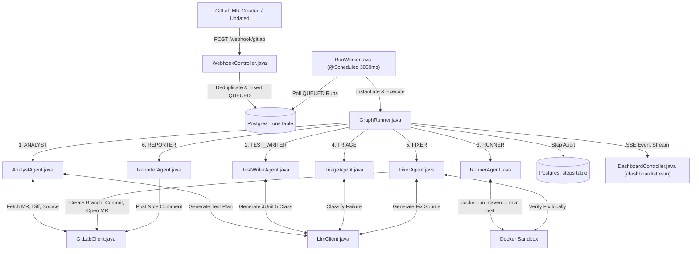

# AgentQA — Exhaustive File-by-File Technical Blueprint & Master Documentation

This document contains the complete, low-level technical specification and line-by-line file scope for **all 22 files** in the **AgentQA** repository (`c:\Users\ADMIN\Desktop\Voziq\AgentQA`).

---

## 1. System Overview & Technology Matrix

AgentQA is an autonomous AI-driven QA system and self-healing MR pipeline built for GitLab with Java 21, Spring Boot 4.1.1, PostgreSQL 16, Groq LLM API, and Docker.

| Layer | Technology | Version | Purpose in AgentQA |
| :--- | :--- | :--- | :--- |
| **Language** | Java 21 | OpenJDK 21 / Temurin | Modern Java 21 features, record classes, pattern matching. |
| **Framework** | Spring Boot | v4.1.1 | Application container, bean management, scheduling. |
| **Web MVC** | `spring-boot-starter-webmvc` | Servlet MVC | RestControllers for webhooks, REST endpoints, and SSE emitters. |
| **HTTP Client** | Spring `RestClient` | Synchronous RestClient | Communicates with Groq API and GitLab REST API v4. |
| **JSON Provider** | Jackson 3 | `tools.jackson.databind` | JSON tree parsing for Spring Boot 4. |
| **Persistence** | Spring Data JPA + Hibernate | `ddl-auto=update` | ORM database mapping for `runs` and `steps` tables. |
| **Database** | PostgreSQL | v16 in Docker (Port 5433) | Task queue and step execution audit log storage. |
| **Scheduling** | `@EnableScheduling` + `@Scheduled` | `fixedDelay = 3000` | Asynchronous worker polling loop. |
| **LLM Inference** | Groq API | Model `openai/gpt-oss-120b` | High-speed LLM inference (2000 max tokens). |
| **VCS Integration** | GitLab REST API v4 | Base URL: `https://gitlab.com` | API calls for fetching code, branches, commits, MR creation, notes. |
| **Test Sandbox** | Docker | `maven:3.9-eclipse-temurin-21` | Sandboxed container running JUnit 5.10.2 & Surefire 3.2.5. |

---

## 2. Master System Communications Flow

---

## 3. Line-by-Line Exhaustive File Scope Breakdown (All 22 Files)

---

### A. Infrastructure & Build Files

#### 1. `pom.xml`
* **File Location**: [pom.xml](file:///c:/Users/ADMIN/Desktop/Voziq/AgentQA/pom.xml)
* **What it Created / Type**: Maven Project Object Model (Build Definition).
* **Purpose**: Defines dependencies, compiler plugins, and Java 21 build properties.
* **What Code it Includes**:
  - `java.version`: 21
  - `spring-boot-starter-parent`: 4.1.1
  - `spring-boot-starter-webmvc`: Web MVC & RestControllers.
  - `spring-boot-starter-data-jpa`: Spring Data JPA & Hibernate.
  - `postgresql`: JDBC Driver for PostgreSQL 16.
  - `spring-boot-devtools`: Hot reload tooling.
* **How it Connects**: Read by Maven (`mvnw` / `mvn`) to build and run the Spring Boot application.

#### 2. `docker-compose.yml`
* **File Location**: [docker-compose.yml](file:///c:/Users/ADMIN/Desktop/Voziq/AgentQA/docker-compose.yml)
* **What it Created / Type**: Docker Compose Service Definition.
* **Purpose**: Manages the persistent PostgreSQL 16 database container.
* **What Specifications it Includes**:
  - Service `postgres`, container name `agentqa-postgres`.
  - Image `postgres:16`.
  - Port mapping `5433:5432` (Exposes PostgreSQL on host port 5433).
  - Environment variables: `POSTGRES_DB=agentqa`, `POSTGRES_USER=agentqa`, `POSTGRES_PASSWORD=agentqa`.
  - Volume mount `pgdata:/var/lib/postgresql/data`.
* **How it Connects**: Connects to Spring Boot via `spring.datasource.url` on port 5433.

#### 3. `application.properties`
* **File Location**: [application.properties](file:///c:/Users/ADMIN/Desktop/Voziq/AgentQA/src/main/resources/application.properties)
* **What it Created / Type**: Spring Application Configuration.
* **Purpose**: Stores runtime database credentials and API configuration properties.
* **What Properties it Includes**:
  - `spring.datasource.url`: `jdbc:postgresql://localhost:5433/agentqa`
  - `spring.jpa.hibernate.ddl-auto`: `update`
  - `agentqa.webhook.secret`: `dev-secret-123`
  - `agentqa.gitlab.base-url`: `https://gitlab.com`
  - `agentqa.gitlab.project-id`: `85861338`
* **How it Connects**: Injected into `WebhookController`, `GitLabClient`, and `RunWorker`.

#### 4. `AgentqaApplication.java`
* **File Location**: [AgentqaApplication.java](file:///c:/Users/ADMIN/Desktop/Voziq/AgentQA/src/main/java/com/agentqa/AgentqaApplication.java)
* **What it Created / Type**: Java Class (`com.agentqa.AgentqaApplication`).
* **Purpose**: Main Spring Boot entry point.
* **What Code it Includes**: `@SpringBootApplication`, `@EnableScheduling`, `public static void main(String[] args)`.
* **How it Connects**: Boots Spring ApplicationContext, scans components, and enables `@Scheduled` worker tasks in `RunWorker.java`.

---

### B. Core State Machine & Agent Framework

#### 5. `Agent.java`
* **File Location**: [Agent.java](file:///c:/Users/ADMIN/Desktop/Voziq/AgentQA/src/main/java/com/agentqa/agent/Agent.java)
* **What it Created / Type**: Java Interface + Inner Enum `Node` + Inner Class `State`.
* **Purpose**: Standardizes agent contract and defines the in-memory blackboard object carried across the graph.
* **What Code & Fields it Includes**:
  - Enum `Node`: `ANALYST`, `TEST_WRITER`, `RUNNER`, `TRIAGE`, `FIXER`, `REPORTER`, `END`.
  - Interface method: `Node node()`, `void execute(State state) throws Exception`.
  - Class `State` Fields: `runId`, `projectId`, `mrIid`, `sourceBranch`, `headSha`, `testPlan`, `sourceFileName`, `sourceCode`, `generatedFiles`, `lastBuildError`, `writerAttempts`, `buildPassed`, `mrTitle`, `mrDescription`, `verdict`, `finding`, `fixLine`, `fixedCode`, `sourceFilePath`, `fixMrIid`, `packageName`.
* **How it Connects**: Implemented by all 6 agents. Carried by `GraphRunner.java`.

#### 6. `GraphRunner.java`
* **File Location**: [GraphRunner.java](file:///c:/Users/ADMIN/Desktop/Voziq/AgentQA/src/main/java/com/agentqa/graph/GraphRunner.java)
* **What it Created / Type**: Spring `@Component` Class (`com.agentqa.graph.GraphRunner`).
* **Purpose**: The hand-rolled state machine engine. Drives state transitions and publishes SSE events.
* **What Code it Includes**:
  - Injected dependencies: `List<Agent>`, `StepRecordRepository`, `DashboardController`, `ObjectMapper`, `LlmClient`.
  - Constructor maps agents: `agents = agentList.stream().collect(Collectors.toMap(Agent::node, Function.identity()))`.
  - State machine loop (`run(state)`): loops while `node != Agent.Node.END`.
  - Transition matrix (`next(current, state)`):
    - `ANALYST -> TEST_WRITER`
    - `TEST_WRITER -> RUNNER`
    - `RUNNER -> (buildPassed ? REPORTER : TRIAGE)`
    - `TRIAGE -> ("TEST_ERROR".equals(verdict) ? (writerAttempts < 3 ? TEST_WRITER : REPORTER) : FIXER)`
    - `FIXER -> REPORTER`
    - `REPORTER -> END`
  - Real-time SSE publisher: `publish(state, agent, attempt, stateName, detail, ms)` $\rightarrow$ calls `dashboard.publish(json)`.
* **How it Connects**: Invoked by `RunWorker.java`. Controls agent execution order and logs audit records in `StepRecordRepository`.

---

### C. The 6 Autonomous Agent Implementations

#### 7. `AnalystAgent.java`
* **File Location**: [AnalystAgent.java](file:///c:/Users/ADMIN/Desktop/Voziq/AgentQA/src/main/java/com/agentqa/agent/AnalystAgent.java)
* **What it Created / Type**: Spring `@Component` Class implementing `Agent` (`Agent.Node.ANALYST`).
* **Purpose**: Requirements analyst agent. Fetches MR info, extracts package declarations, and prompts LLM for JSON test plan.
* **What Code it Includes**:
  - Dependencies: `LlmClient`, `GitLabClient`.
  - Helper method `packageOf(source)`: Parses `package com.demo.shop;` header from source code.
  - Inverted Prompt: *"Judge the code against what the merge request promises, not against itself."*
  - Populates `state.setTestPlan()`, `state.setSourceFileName()`, `state.setSourceCode()`, `state.setPackageName()`.
* **How it Connects**: Invoked by `GraphRunner` at Node 1.

#### 8. `TestWriterAgent.java`
* **File Location**: [TestWriterAgent.java](file:///c:/Users/ADMIN/Desktop/Voziq/AgentQA/src/main/java/com/agentqa/agent/TestWriterAgent.java)
* **What it Created / Type**: Spring `@Component` Class implementing `Agent` (`Agent.Node.TEST_WRITER`).
* **Purpose**: Generates JUnit 5 test classes.
* **What Code it Includes**:
  - Dependencies: `LlmClient`.
  - System Prompt Rules: Declares SAME package as class under test, no reflection, no assumptions, no stubbing, never weaken assertions.
  - Retry logic: Appends `lastBuildError` when `state.getLastBuildError() != null`.
  - Stores generated code in `state.getGeneratedFiles().add(code)`.
* **How it Connects**: Invoked by `GraphRunner` at Node 2.

#### 9. `RunnerAgent.java`
* **File Location**: [RunnerAgent.java](file:///c:/Users/ADMIN/Desktop/Voziq/AgentQA/src/main/java/com/agentqa/agent/RunnerAgent.java)
* **What it Created / Type**: Spring `@Component` Class implementing `Agent` (`Agent.Node.RUNNER`).
* **Purpose**: Executes tests inside isolated Docker sandbox container.
* **What Code it Includes**:
  - `buildIn(work, state, sourceCode)`: Creates package subdirectories (`src/main/java/com/demo/shop/CartService.java` and `src/test/java/com/demo/shop/CartServiceTest.java`).
  - Writes synthetic `pom.xml` (Java 21, JUnit 5.10.2, Surefire 3.2.5).
  - Executes ProcessBuilder: `docker run --rm -v work:/app -v ~/.m2:/root/.m2 maven:3.9-eclipse-temurin-21 mvn -q -B test`.
  - Timeout: 5 minutes (`process.waitFor(5, TimeUnit.MINUTES)`).
  - Exit code 0 $\rightarrow$ `buildPassed = true`; Exit code != 0 $\rightarrow$ `buildPassed = false`, trims log to 60 lines.
* **How it Connects**: Invoked by `GraphRunner` at Node 3. Also invoked by `FixerAgent` for local re-verification!

#### 10. `TriageAgent.java`
* **File Location**: [TriageAgent.java](file:///c:/Users/ADMIN/Desktop/Voziq/AgentQA/src/main/java/com/agentqa/agent/TriageAgent.java)
* **What it Created / Type**: Spring `@Component` Class implementing `Agent` (`Agent.Node.TRIAGE`).
* **Purpose**: Failure classification engineer.
* **What Code it Includes**:
  - Dependencies: `LlmClient`.
  - System prompt: Returns JSON `{"verdict":"TEST_ERROR|CODE_DEFECT", "finding":"..."}`.
  - Verdict parsing: `reply.contains("CODE_DEFECT")` $\rightarrow$ `verdict = "CODE_DEFECT"`, else `"TEST_ERROR"`.
* **How it Connects**: Invoked by `GraphRunner` at Node 4 on build failure.

#### 11. `FixerAgent.java`
* **File Location**: [FixerAgent.java](file:///c:/Users/ADMIN/Desktop/Voziq/AgentQA/src/main/java/com/agentqa/agent/FixerAgent.java)
* **What it Created / Type**: Spring `@Component` Class implementing `Agent` (`Agent.Node.FIXER`).
* **Purpose**: Autonomous code repair engineer & Auto-Fix MR author.
* **What Code it Includes**:
  - Dependencies: `LlmClient`, `GitLabClient`, `RunnerAgent`.
  - System prompt: *"Return the COMPLETE corrected source file including its package declaration..."*
  - Re-verification: Calls `runner.build(state, fixed)` locally in Docker (aborts if `fixWorks == false`).
  - Auto-Fix MR sequence:
    1. `gitlab.getBranchSha()`
    2. `gitlab.createBranch(projectId, "agentqa/fix-mr-" + mrIid, headSha)`
    3. `gitlab.updateFile(projectId, sourceFilePath, branch, fixed, message)`
    4. `gitlab.createMergeRequest(projectId, branch, sourceBranch, title, description)`
  - Stores `state.setFixMrIid(iid)`.
* **How it Connects**: Invoked by `GraphRunner` at Node 5 when `verdict == "CODE_DEFECT"`.

#### 12. `ReporterAgent.java`
* **File Location**: [ReporterAgent.java](file:///c:/Users/ADMIN/Desktop/Voziq/AgentQA/src/main/java/com/agentqa/agent/ReporterAgent.java)
* **What it Created / Type**: Spring `@Component` Class implementing `Agent` (`Agent.Node.REPORTER`).
* **Purpose**: Report communicator.
* **What Code it Includes**:
  - Dependencies: `GitLabClient`.
  - Formats Markdown report (Passed / Defect Found + Fix MR Link / Retries Exhausted).
  - Calls `gitlab.postComment(projectId, mrIid, body)`.
* **How it Connects**: Invoked by `GraphRunner` at Node 6.

---

### D. External Client Integration Services

#### 13. `GitLabClient.java`
* **File Location**: [GitLabClient.java](file:///c:/Users/ADMIN/Desktop/Voziq/AgentQA/src/main/java/com/agentqa/gitlab/GitLabClient.java)
* **What it Created / Type**: Spring `@Component` Class (`com.agentqa.gitlab.GitLabClient`).
* **Purpose**: REST API v4 wrapper for GitLab.
* **What Code & Methods it Includes**:
  - Injected property: `@Value("${agentqa.gitlab.base-url}") String baseUrl`. Validates `GITLAB_TOKEN` env var.
  - Methods:
    - `getMergeRequest(projectId, mrIid)` $\rightarrow$ `GET /projects/{p}/merge_requests/{i}`
    - `getChanges(projectId, mrIid)` $\rightarrow$ `GET /projects/{p}/merge_requests/{i}/changes`
    - `getFile(projectId, path, ref)` $\rightarrow$ `GET /projects/{p}/repository/files/{path}/raw`
    - `postComment(projectId, mrIid, body)` $\rightarrow$ `POST /projects/{p}/merge_requests/{i}/notes`
    - `getBranchSha(projectId, branch)` $\rightarrow$ `GET /projects/{p}/repository/branches/{branch}`
    - `createBranch(projectId, newBranch, fromRef)` $\rightarrow$ `POST /projects/{p}/repository/branches`
    - `updateFile(projectId, path, branch, content, message)` $\rightarrow$ `PUT /projects/{p}/repository/files/{path}`
    - `createMergeRequest(projectId, source, target, title, description)` $\rightarrow$ `POST /projects/{p}/merge_requests`
* **How it Connects**: Called by `AnalystAgent`, `FixerAgent`, and `ReporterAgent`.

#### 14. `LlmClient.java`
* **File Location**: [LlmClient.java](file:///c:/Users/ADMIN/Desktop/Voziq/AgentQA/src/main/java/com/agentqa/llm/LlmClient.java)
* **What it Created / Type**: Spring `@Component` Class (`com.agentqa.llm.LlmClient`).
* **Purpose**: REST API client for Groq LLM inference.
* **What Code & Methods it Includes**:
  - Validates `GROQ_API_KEY` env var.
  - Base URL: `https://api.groq.com`, Model: `openai/gpt-oss-120b`, Max tokens: 2000.
  - Method `complete(systemPrompt, userPrompt)` $\rightarrow$ `POST /openai/v1/chat/completions`.
  - Method `field(json, key, default)` $\rightarrow$ Helper to extract JSON fields safely.
* **How it Connects**: Called by `AnalystAgent`, `TestWriterAgent`, `TriageAgent`, `FixerAgent`, and `GraphRunner`.

---

### E. Webhook Ingress & Task Worker

#### 15. `WebhookController.java`
* **File Location**: [WebhookController.java](file:///c:/Users/ADMIN/Desktop/Voziq/AgentQA/src/main/java/com/agentqa/webhook/WebhookController.java)
* **What it Created / Type**: Spring `@RestController` Class (`com.agentqa.webhook.WebhookController`).
* **Purpose**: Ingress endpoint for GitLab webhooks.
* **What Code it Includes**:
  - Injected dependencies: `RunRepository`, `@Value("${agentqa.webhook.secret}") String secret`.
  - Endpoint: `@PostMapping("/gitlab")`.
  - Checks header `X-Gitlab-Token` matches `secret`.
  - Filters `object_kind == "merge_request"` and `action in ["open", "update", "reopen"]`.
  - Deduplicates via `runRepository.existsByProjectIdAndMrIidAndHeadShaAndStatusIn(QUEUED, RUNNING)`.
  - Saves new `Run(QUEUED)` entity. Returns `200 OK ("queued run {id}")`.
* **How it Connects**: Receives HTTP requests from GitLab Webhooks. Saves runs to PostgreSQL `runs` table.

#### 16. `RunWorker.java`
* **File Location**: [RunWorker.java](file:///c:/Users/ADMIN/Desktop/Voziq/AgentQA/src/main/java/com/agentqa/worker/RunWorker.java)
* **What it Created / Type**: Spring `@Component` Class (`com.agentqa.worker.RunWorker`).
* **Purpose**: Background queue polling worker.
* **What Code it Includes**:
  - Injected dependencies: `RunRepository`, `GraphRunner`.
  - Scheduled method: `@Scheduled(fixedDelay = 3000) public void pollQueue()`.
  - Queries `runRepository.findByStatusOrderByCreatedAtAsc(RunStatus.QUEUED)`.
  - Updates run status to `RUNNING`.
  - Instantiates `Agent.State state = new Agent.State(...)`.
  - Calls `graphRunner.run(state)`.
  - Catches exceptions: sets status to `DONE` on success or `FAILED` on exception.
* **How it Connects**: Scheduled by Spring framework every 3 seconds. Triggers `GraphRunner`.

---

### F. Database Entities & Repositories

#### 17. `Run.java` & `RunStatus.java`
* **File Location**: [Run.java](file:///c:/Users/ADMIN/Desktop/Voziq/AgentQA/src/main/java/com/agentqa/run/Run.java), [RunStatus.java](file:///c:/Users/ADMIN/Desktop/Voziq/AgentQA/src/main/java/com/agentqa/run/RunStatus.java)
* **What it Created / Type**: JPA `@Entity` Class + Enum `RunStatus`.
* **Purpose**: Maps to PostgreSQL `runs` table.
* **What Code it Includes**:
  - `@Table(name = "runs")`
  - Fields: `id` (PK, @GeneratedValue), `projectId`, `mrIid`, `sourceBranch`, `headSha`, `status` (Enum `QUEUED`, `RUNNING`, `WAITING_APPROVAL`, `DONE`, `FAILED`, `REJECTED`), `createdAt`, `updatedAt`.
* **How it Connects**: Managed by Hibernate / JPA. Queried by `RunRepository`.

#### 18. `RunRepository.java`
* **File Location**: [RunRepository.java](file:///c:/Users/ADMIN/Desktop/Voziq/AgentQA/src/main/java/com/agentqa/run/RunRepository.java)
* **What it Created / Type**: Spring Data JPA Interface extending `JpaRepository<Run, Long>`.
* **Purpose**: Database access interface for `Run` entities.
* **What Query Methods it Includes**:
  - `List<Run> findByStatusOrderByCreatedAtAsc(RunStatus status)`
  - `Optional<Run> findFirstByProjectIdAndMrIidAndStatus(...)`
  - `boolean existsByProjectIdAndMrIidAndHeadShaAndStatusIn(...)`
* **How it Connects**: Used by `WebhookController` and `RunWorker`.

#### 19. `StepRecord.java` & `StepRecordRepository.java`
* **File Location**: [StepRecord.java](file:///c:/Users/ADMIN/Desktop/Voziq/AgentQA/src/main/java/com/agentqa/run/StepRecord.java), [StepRecordRepository.java](file:///c:/Users/ADMIN/Desktop/Voziq/AgentQA/src/main/java/com/agentqa/run/StepRecordRepository.java)
* **What it Created / Type**: JPA `@Entity` Class + JpaRepository Interface.
* **Purpose**: Maps to PostgreSQL `steps` table for audit trail.
* **What Code it Includes**:
  - `@Table(name = "steps")`
  - Fields: `id`, `runId` (FK to runs.id), `agent`, `attempt`, `startedAt`, `finishedAt`, `outcome` ("OK", "FAILED"), `detail`.
  - Repository method: `findByRunIdOrderByStartedAtAsc(Long runId)`.
* **How it Connects**: Used by `GraphRunner` to record audit steps and `RunController` to display execution paths.

---

### G. Monitoring & Dashboard Web Controllers

#### 20. `RunController.java`
* **File Location**: [RunController.java](file:///c:/Users/ADMIN/Desktop/Voziq/AgentQA/src/main/java/com/agentqa/run/RunController.java)
* **What it Created / Type**: Spring `@RestController` Class (`com.agentqa.run.RunController`).
* **Purpose**: REST API endpoints for querying run timelines and step audit history.
* **What Code & Endpoints it Includes**:
  - Injected dependencies: `RunRepository`, `StepRecordRepository`.
  - `@GetMapping("/{id}")`: Returns `RunDetail` JSON containing full step path (e.g. `ANALYST#1 -> TEST_WRITER#1 -> RUNNER#1 -> TRIAGE#1 -> FIXER#1 -> REPORTER#1`) and step durations.
  - `@GetMapping`: Returns `List<RunSummary>` recent runs.
* **How it Connects**: Called by web clients / CLI for status auditing.

#### 21. `DashboardController.java`
* **File Location**: [DashboardController.java](file:///c:/Users/ADMIN/Desktop/Voziq/AgentQA/src/main/java/com/agentqa/dashboard/DashboardController.java)
* **What it Created / Type**: Spring `@RestController` Class (`com.agentqa.dashboard.DashboardController`).
* **Purpose**: Server-Sent Events (SSE) streaming controller for real-time live UI updates.
* **What Code it Includes**:
  - `CopyOnWriteArrayList<SseEmitter> clients`.
  - `@GetMapping("/dashboard/stream")`: Registers new client SSE stream.
  - `publish(String json)`: Broadcasts real-time JSON events to all connected clients.
* **How it Connects**: `GraphRunner` calls `dashboard.publish()` on every step. Streams live events to `dashboard.html`.

#### 22. `dashboard.html`
* **File Location**: [dashboard.html](file:///c:/Users/ADMIN/Desktop/Voziq/AgentQA/src/main/resources/static/dashboard.html)
* **What it Created / Type**: Static HTML/JS Web Dashboard UI.
* **Purpose**: Real-time web user interface for watching AgentQA executions.
* **What Code it Includes**:
  - JavaScript `EventSource('/dashboard/stream')` subscriber.
  - Displays live timeline cards, risk levels, build pass/fail badges, defect findings, and direct links to newly opened Auto-Fix MRs (`fixMr`)!
* **How it Connects**: Served by Spring Boot static asset handler at `http://localhost:8080/dashboard.html`.

---

## 4. Summary Matrix of File Interconnections

| Source File | Primary Dependents (Callers / Users) | Downstream Dependencies Called | External Systems Contacted |
| :--- | :--- | :--- | :--- |
| **`AgentqaApplication`** | Spring Framework Bootstrapper | `RunWorker` | None |
| **`WebhookController`** | GitLab Webhook Ingress | `RunRepository`, `Run` | GitLab Webhook Client |
| **`RunWorker`** | `@Scheduled` Spring Thread | `RunRepository`, `GraphRunner`, `Agent.State` | PostgreSQL Database |
| **`GraphRunner`** | `RunWorker` | All 6 `Agent` beans, `StepRecordRepository`, `DashboardController`, `LlmClient` | PostgreSQL Database |
| **`AnalystAgent`** | `GraphRunner` | `GitLabClient`, `LlmClient` | GitLab REST API, Groq LLM API |
| **`TestWriterAgent`** | `GraphRunner` | `LlmClient` | Groq LLM API |
| **`RunnerAgent`** | `GraphRunner`, `FixerAgent` | Native `ProcessBuilder` | Docker Sandbox (`maven:3.9-eclipse-temurin-21`) |
| **`TriageAgent`** | `GraphRunner` | `LlmClient` | Groq LLM API |
| **`FixerAgent`** | `GraphRunner` | `LlmClient`, `RunnerAgent`, `GitLabClient` | Groq LLM API, Docker Sandbox, GitLab REST API |
| **`ReporterAgent`** | `GraphRunner` | `GitLabClient` | GitLab REST API |
| **`GitLabClient`** | `AnalystAgent`, `FixerAgent`, `ReporterAgent` | Spring `RestClient` | GitLab REST API v4 (`https://gitlab.com`) |
| **`LlmClient`** | `AnalystAgent`, `TestWriterAgent`, `TriageAgent`, `FixerAgent`, `GraphRunner` | Spring `RestClient` | Groq LLM API (`https://api.groq.com`) |
| **`DashboardController`** | `GraphRunner` | `SseEmitter` | Browser EventSource (`dashboard.html`) |
| **`RunController`** | Browser / REST Clients | `RunRepository`, `StepRecordRepository` | PostgreSQL Database |
